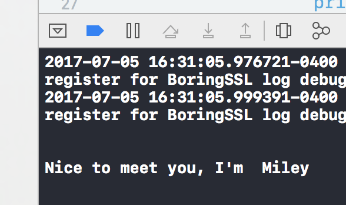
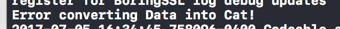
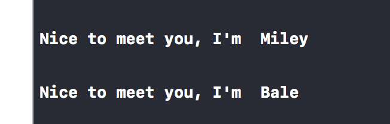

# AC-iOS Codable and UserDefaults: Part II JSON Codables (Swift 4.x)

---
### Readings
1. [Ultimate Guide to Parsing With Swift](http://benscheirman.com/2017/06/ultimate-guide-to-json-parsing-with-swift-4/?utm_campaign=iOS%2BDev%2BWeekly&utm_medium=email&utm_source=iOS_Dev_Weekly_Issue_306)
1. [An Introduction to NSUserDefaults](http://www.codingexplorer.com/nsuserdefaults-a-swift-introduction/)


### 0. Overall Goals

1. Become familiar with using `UserDefaults` to store data
2. Understand that `UserDefaults` is a light-weight, persistant storage option for small amounts of data that relate to how your app should be configured, based on the user's selection/choices.
3. Become with the `Codable` protocol that allows for easy conversion between Swift objects and storeable `Data`

---
###  1. `JSONDecoder` and `Codable`

`Codeable` makes a world of difference when it comes to working with JSON. Rather than using our old friend `JSONSerialization`, we use `JSONDecoder` when we can guarantee that the object we're creating conforms to `Codable`. Let's start off with a simple eample using another old friend, `Cat`! (conveniently provided as its own file in the starter project):

```swift
struct Cat: Codable {
	let name: String
	let breed: String
	let snack: String
}
```

We'll be using the provided `CatRequester` to make our API requests. At the top of the class you'll notice a list of `URL` to use for various examples:

```swift
	let example1URL = URL(string: "https://api.myjson.com/bins/1h4707")!
	let example2URL = URL(string: "https://api.myjson.com/bins/fq67r")!
	let example3URL = URL(string: "https://api.myjson.com/bins/oatbr")!
	let example4URL = URL(string: "https://api.myjson.com/bins/vg0l3")!
```

#### Basic JSON Request

We're first going fill out the function labeled `makeBasicCatRequest` and make a request using `example1URL`. If we plug in `example1URL` into Postman, we get

```json
{
    "name": "Miley",
    "breed": "American Shorthair",
    "snack": "Chicken"
}
```

The key to using a model that conforms to `Codable` along with `JSONDecoder` is to ensure that the names of instance properties of the model match the keys in the JSON response. Our `Cat` model has three properties, `name, breed, snack` which correspond to the keys being returned in the JSON response, `name, breed` and snack. You don't have to know the full details yet on how this works, but just understand that this is how you make this kind of decoding work.

Now, we'll do a basic `URLSession` data task to make a model:

```swift
func makeBasicCatRequest() {
	urlSession.dataTask(with: example1URL) { (data: Data?, _, _) in
		if data != nil {
			do {
				let cat = try JSONDecoder().decode(Cat.self, from: data!)
				print("\n\nNice to meet you, I'm ", cat.name)
			}
			catch {
				print("Error converting Data into Cat!", error)
			}
		}
	}.resume()
}
```



#### Incorrectly Named JSON Keys

Ok, now replace `example1URL` with `example2URL` and observe the difference. Putting in `example2URL` into Postman gives us:

```json
{
    "fullname": "Miley",
    "breed": "American Shorthair",
    "snack": "Chicken"
}
```

With `fullname` no longer matching a `Cat.name` property, attempting to decode results in an error.



#### Nested JSON Structure

Let's now take a look at a nested dictionary structure. Replace `example2URL` with `example3URL` and verify that in Postman you're getting this JSON response:

```json
{
  "cat": {
    "name": "Miley",
    "breed": "American Shorthair",
    "snack": "Chicken"
  }
}
```

In this example, our `Cat` dictionary is wrapped up using a `"cat"` key/value pair. To access the deeper level of the dictionary, (to get `name`, `breed`, and `snack`) we can simply create a wrapper struct like so:

```swift
// Nested Cat object wrapped in a "cat" key
struct CatContainer: Codable {
	let cat: Cat
}
```

Now, we just need to update the code so that `JSONDecoder` expects to decode a `CatContainer` rather than a `Cat` directly.

```swift
	// just change the expected type from `Cat` to `CatContainer`!
	let catContainer = try JSONDecoder().decode(CatContainer.self, from: data!)
	print("\n\nNice to meet you, I'm ", catContainer.cat.name)
```

#### JSON Array Structure

Let's look at one more example where the root object is an array of `Cats`. We're going to use `example4URL` which should have a JSON response like:

```json
{
  "cats": [
    {
      "name": "Miley",
      "breed": "American Shorthair",
      "snack": "Chicken"
    },
    {
      "name": "Bale",
      "breed": "Russian Blue",
      "snack": "Kibble"
    }
  ]
}
```

 You might already be able to guess what needs to be done for this to work... make a wrapper struct!

```swift
struct CatArrayContainer: Codable {
	let cats: [Cat]
}
```

And now we just update our `JSONDecoder` code to make use of the new wrapper:

```swift
let catArrayContainer = try JSONDecoder().decode(CatArrayContainer.self, from: data!)
for cat in catArrayContainer.cats {
	print("\n\nNice to meet you, I'm ", cat.name)
}
```




### 2. Exercises

For this set of exercises, follow these general guidelines:

1. Create a new file, `Pods.swift` to add all of the structs you will be writing
2. Create a new file, `PodRequestor` to create a request for each example problem. You should name these functions like `func example1Request`, `func example2Request`, etc...
3. Call each new request in either the `AppDelegate`'s `didFinishLaunching` or in `ViewController`'s `viewDidLoad`
4. There are no tests for these exercises, so instead print out to console the result of each successful request. For example after creating a `Podcast` object, have `print("Podcast created: ",  podcast.podcast)`
5. Exercise answers are provided to you under `Exercises/Exercises.md`. Be sure to attempt a problem before checking the answer

> Note: For each of these exercises, make sure that you're checking out the JSON response for each URL using Postman. The response should match the snippets provided with the exercise questions, but you are to verify this.

#### Pod(s) Save America

---
*Example 1*: `https://api.myjson.com/bins/tq46v`

- Create a new model, `Podcast` that conforms to `Codable`
- Make a request the the URL listed and create an instance of `Podcast`

```json
{
    "podcast": "Pod Save America",
    "producer": "Crooked Media",
    "url": "https://itunes.apple.com/us/podcast/pod-save-america/id1192761536?mt=2"
}
```

---
*Example 2*:  `https://api.myjson.com/bins/182vl3`

-  Create a new wrapper, `PodInfo` to house a `Podcast` object

```json
{
    "pod": {
        "podcast": "Pod Save America",
        "producer": "Crooked Media",
        "url": "https://itunes.apple.com/us/podcast/pod-save-america/id1192761536?mt=2"
    }
}
```

---
*Example 3*: `https://api.myjson.com/bins/n8pev`

- Create a new struct, `Episode`

```json
{
  "title": "Making Redistricting Sexy Again...",
  "time": "1hr 19min",
  "released": "June 6 2017",
  "number": 1
}
```

---
*Example 4*: `https://api.myjson.com/bins/mn9t3`

- Expand `Pod` to include `[Episode]`

```json
{
    "pod": {
        "podcast": "Pod Save America",
        "producer": "Crooked Media",
        "url": "https://itunes.apple.com/us/podcast/pod-save-america/id1192761536?mt=2",
        "episodes": [
            {
                "title": "Making Redistricting Sexy Again...",
                "time": "1hr 19min",
                "released": "June 6 2017",
                "number": 1
            }
        ]
    }
}
```

---
*Example 5*: `https://api.myjson.com/bins/18qgcn`

- Extend `PodInfo` to expect an array of `Podcast`

```json
{
  "pods": [
    {
      "podcast": "Pod Save America",
      "producer": "Crooked Media",
      "url": "https://itunes.apple.com/us/podcast/pod-save-america/id1192761536?mt=2",
      "episodes": [
        {
          "title": "Making Redistricting Sexy Again...",
          "time": "1hr 19min",
          "released": "June 6 2017",
          "number": 1
        }
      ]
    },
    {
      "podcast": "The Daily",
      "producer": "New York Times",
      "url": "https://itunes.apple.com/us/podcast/the-daily/id1200361736?mt=2",
      "episodes": [
        {
          "title": "Friday July 7th",
          "time": "22min",
          "released": "June 7 2017",
          "number": 1
        }
      ]
    }
  ]
}
```

---
*Example 6*: `https://api.myjson.com/bins/7xv5z`

- Extend `PodInfo` to have a new property for `meta` data. The `meta` property should be of type `PodMeta` and also `Codable`

```json
{
    "meta": {
        "date_requested": "2017-07-07 17:23:50 +0000"
    },
    "pods": [
        {
            "podcast": "Pod Save America",
            "producer": "Crooked Media",
            "url": "https://itunes.apple.com/us/podcast/pod-save-america/id1192761536?mt=2",
            "episodes": [
                {
                    "title": "Making Redistricting Sexy Again...",
                    "time": "1hr 19min",
                    "released": "June 6 2017",
                    "number": 1
                }
            ]
        },
        {
            "podcast": "The Daily",
            "producer": "New York Times",
            "url": "https://itunes.apple.com/us/podcast/the-daily/id1200361736?mt=2",
            "episodes": [
                {
                    "title": "Friday July 7th",
                    "time": "22min",
                    "released": "June 7 2017",
                    "number": 1
                }
            ]
        }
    ]
}
```

####  Once More!

The previous examples should have given you an understand on how you can start from a very simple JSON structure and build it up to into something far more complicated.

In this last example, you will be challenged to do this entire building process on your own. You'll be using a URL from the  Random User API that I provide in order to create a few new structs. I will also provide you with a sample output JSON using that URL.

What you'll need to do is the following:

1. Create a wrapper, `APIResult` that will contain an array of `User` and a dictionary `Info`
2. The `User` struct, will have several properties: `gender, email, registered`
3. The `User` struct will also have several `Codable` properties: `name: Name, picture: Picture`
4. The `Name` struct should have three properties: `title, first, last`
5. The `Picture` struct should have three properties: `large, medium, thumbnail`
6. The `Info` struct will have four properties: `seed, results, page, version`. Please be aware that `results` and `pages` are not `String`


**URL**: `https://randomuser.me/api/?nat=us&inc=gender,name,email,registered,picture`

```json
{
    "results": [
        {
            "gender": "male",
            "name": {
                "title": "mr",
                "first": "cory",
                "last": "wagner"
            },
            "email": "cory.wagner@example.com",
            "registered": "2011-07-21 03:55:39",
            "picture": {
                "large": "https://randomuser.me/api/portraits/men/17.jpg",
                "medium": "https://randomuser.me/api/portraits/med/men/17.jpg",
                "thumbnail": "https://randomuser.me/api/portraits/thumb/men/17.jpg"
            }
        }
    ],
    "info": {
        "seed": "a10c8066754a7d56",
        "results": 1,
        "page": 1,
        "version": "1.1"
    }
}
```

---
#### *Advanced*: Formatting Time


In example 6, you received a new key `meta` that had a single key/value `date`. That problem only requires you to express the date passed as a `String` but now you are tasked with parsing the value as a `Date` instead. You must convert the formatted date by using `DateFormatter` so that it reads: `"Month Day, Year  <Hour:Minute>"` in console.

<details>
<summary>Implementation hints</summary>
<br><br>
<ol>
<li> You're going to need to create & use <code>DateFormatter</code>
<li> You need to change <code>Meta.date_requested</code> from a <code>String</code> to <code>Date</code>
<li> You'll need to change <code>JSONDecoder</code>'s <code>dateDecodingStrategy</code> to <code>.dateFormatted(DateFormatter)</code>
<li> You're going to need to update your <code>DateFormatter</code>'s <code>.dateFormat</code> property twice: once for decoding the string value of the date from the JSON into <code>Date</code> and then once again to output the <code>Date</code> as a <code>String</code>
</ol>
<br><br>
</details>

#### Resources For Advanced

1. [Ultimate Guide to JSON Parsing with Swift 4](http://benscheirman.com/2017/06/ultimate-guide-to-json-parsing-with-swift-4/?utm_campaign=iOS%2BDev%2BWeekly&utm_medium=email&utm_source=iOS_Dev_Weekly_Issue_306)
2. [NSDateFormatter.com](http://nsdateformatter.com/)
